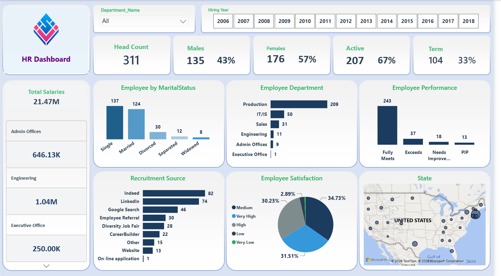

# 👥 HR Analytics Dashboard
### Workforce Insights &amp; Employee Metrics — Power BI

---

## 📌 Overview

An interactive Power BI dashboard analyzing workforce composition, recruitment channels, performance ratings, and employee satisfaction for an organization with 300+ employees. Built on a public/sample HR dataset to demonstrate end-to-end HR analytics capability — from headcount tracking to satisfaction and performance insights.

## 🎯 Business Problem

HR teams need a consolidated view of workforce demographics, department distribution, recruitment channel effectiveness, and employee satisfaction/performance to support hiring decisions, retention planning, and department-level workforce planning.

## 🛠️ Tools &amp; Technologies

<table>
<tr><td><b>BI Tool</b></td><td>Power BI Desktop &amp; Service</td></tr>
<tr><td><b>Data Modeling</b></td><td>DAX measures (Headcount, Active/Term %, Gender %, Satisfaction %)</td></tr>
<tr><td><b>Data Prep</b></td><td>Power Query (M Language)</td></tr>
<tr><td><b>Visuals</b></td><td>Filled map, donut chart, bar &amp; column charts, KPI cards</td></tr>
<tr><td><b>Data Source</b></td><td>Public/sample HR employee dataset</td></tr>
</table>

## ✨ Key Features

- **Workforce KPI Cards** — Head Count, Male/Female split with %, Active vs. Terminated employees with %, and Total Salaries.
- **Interactive Filters** — Slice by Department and Hiring Year (2006–2018).
- **Marital Status Breakdown** — Column chart of employees by marital status (Single, Married, Divorced, Separated, Widowed).
- **Department Distribution** — Bar chart ranking headcount across departments (Production, IT/IS, Sales, Engineering, Admin Offices, Executive Office).
- **Performance Overview** — Column chart of performance ratings (Fully Meets, Exceeds, Needs Improvement, PIP).
- **Recruitment Source Analysis** — Bar chart comparing hiring channel effectiveness (Indeed, LinkedIn, Google Search, Employee Referral, Diversity Job Fair, CareerBuilder, Website, Online Application).
- **Employee Satisfaction** — Donut chart segmenting satisfaction levels (Very High, High, Medium, Low, Very Low).
- **Salary Breakdown by Department** — Drill-down panel showing total salary cost per department.
- **Geographic Distribution** — Filled map plotting employee locations across the United States.

## 📈 Dashboard Preview

## 🔍 Approach

1. **Data Preparation** — Cleaned and structured employee records using Power Query (department, marital status, recruitment source, performance rating, satisfaction score, location).
2. **Data Modeling** — Built DAX measures for headcount, gender %, active/terminated %, and satisfaction distribution.
3. **Dashboard Design** — Designed a single-page HR overview combining KPI cards, demographic breakdowns, recruitment analysis, and geographic distribution for HR stakeholders.
4. **Interactivity** — Added department and hiring-year filters to let users drill into specific segments of the workforce.

## 📊 Key Insights

<!-- [ADD: any takeaway you found interesting, e.g. "Indeed and LinkedIn together account for the majority of hires, suggesting recruitment budget could be optimized toward these channels."] -->

---

**Sameh El-Hosary** | Data Analyst &amp; Business Intelligence Analyst
[LinkedIn](https://linkedin.com/in/sameh-el-hosary-) · [GitHub](https://github.com/SamehElhosary0) · [Email](mailto:sameh.sabry656@gmail.com)

